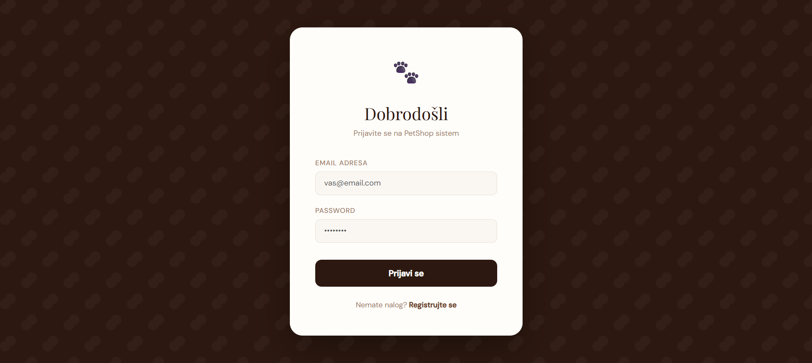
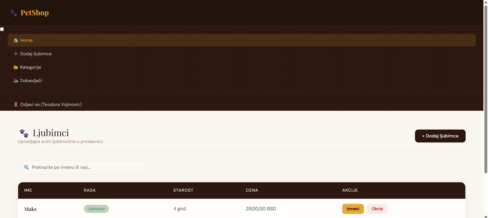
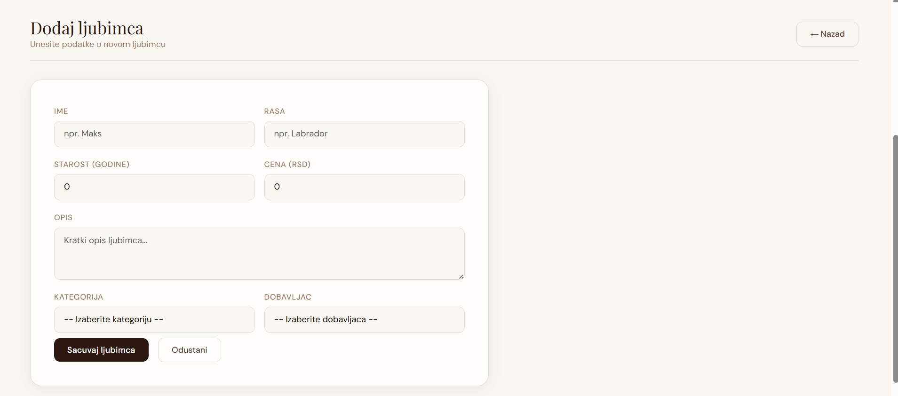
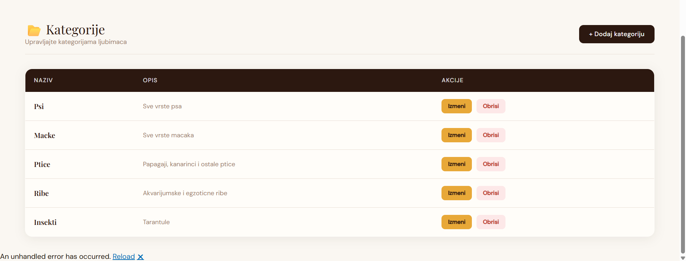
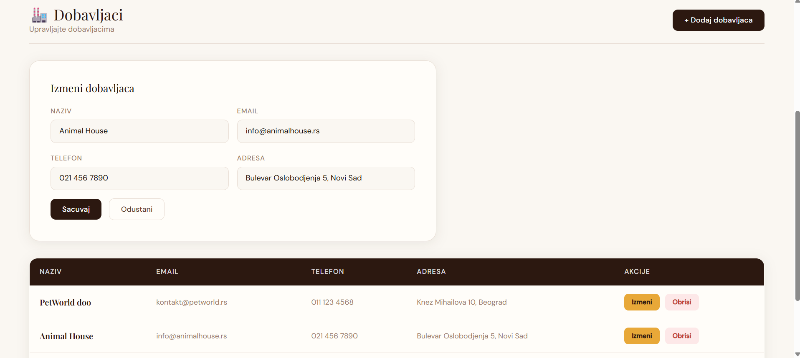

# PetShop System

PetShop je web aplikacija za upravljanje prodavnicom ljubimaca, razvijena na .NET platformi koristeći višeslojnu arhitekturu. Sistem omogućava registraciju i prijavu putem JWT autentifikacije, pregled i pretragu ljubimaca po imenu ili rasi, dodavanje, izmjenu i brisanje ljubimaca, kao i upravljanje kategorijama i dobavljačima.

Aplikacija je izgrađena po principu razdvajanja odgovornosti — Entities sloj definiše modele podataka, DAL sloj komunicira sa SQL Server bazom kroz parametrizovane SQL upite, BusinessLayer obrađuje poslovnu logiku, API projekat izlaže REST endpointe dokumentovane kroz Swagger, a WebApp je Blazor Server aplikacija koja pruža korisnički interfejs. Sigurnost je osigurana BCrypt hashiranjem lozinki i JWT tokenima, dok je poslovna logika pokrivena jediničnim testovima po AAA principu uz korišćenje Mock objekata.

## Tehnologije

C# · .NET · Blazor Server · SQL Server · JWT · BCrypt · Swagger · xUnit · Moq

## Screenshots

